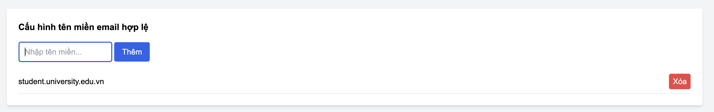
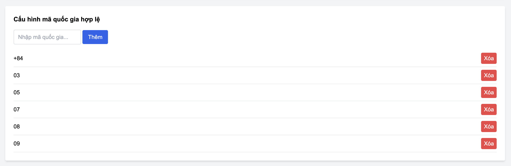
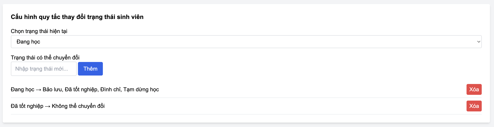
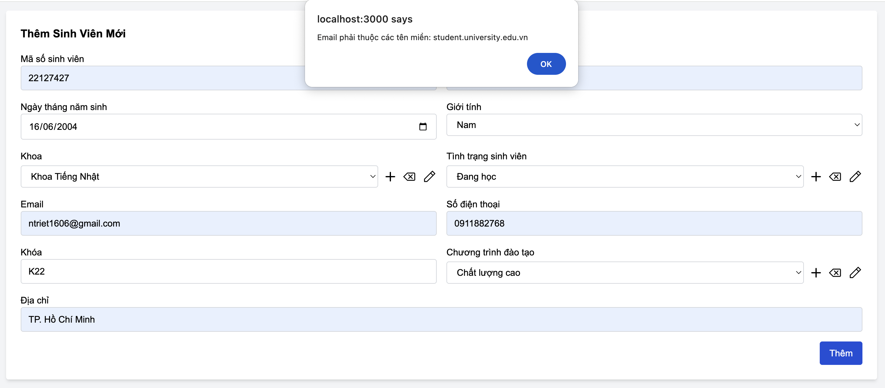
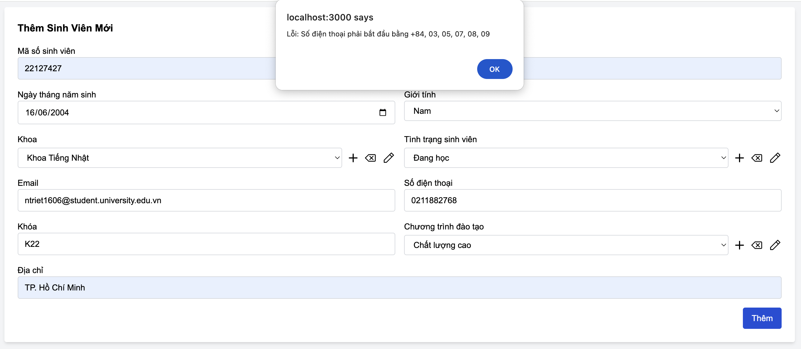
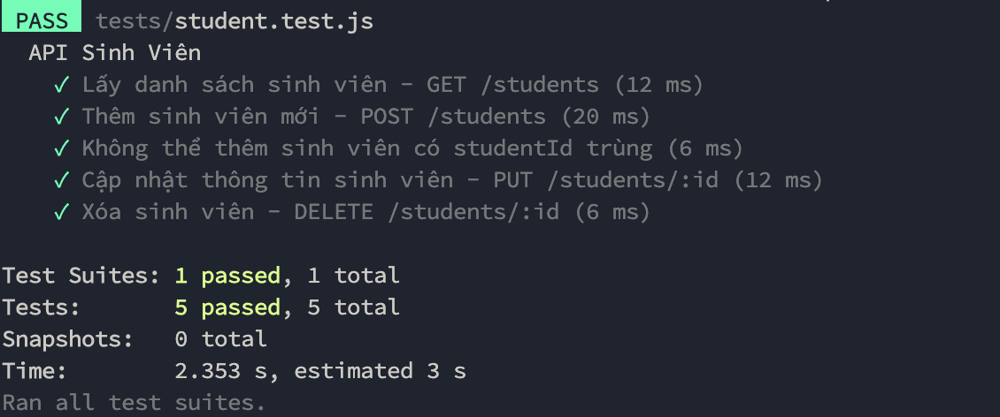

# TKPM-EXERCISE

# NOTE:
- Do em tải file zip của project về và làm trên đó (xong em mới để qua file clone và commit lên) nên sẽ có vài file không giống như trong ảnh do em chụp bên file zip em download về. Em cảm ơn thầy ạ. 

# Mục lục

1. [Chạy bằng link web](#1-chạy-bằng-link-web)  
2. [Cập nhật trong Version 3.0](#2-cập-nhật-trong-version-30)  
   - [2.1. MSSV phải là duy nhất](#21-mssv-phải-là-duy-nhất)  
   - [2.2. Email phải thuộc một tên miền nhất định (configurable)](#22-email-phải-thuộc-một-tên-miền-nhất-định-configurable)  
   - [2.3. Số điện thoại phải có định dạng hợp lệ theo quốc gia (configurable)](#23-số-điện-thoại-phải-có-định-dạng-hợp-lệ-theo-quốc-gia-configurable)  
   - [2.4. Tình trạng sinh viên chỉ có thể thay đổi theo một số quy tắc (configurable)](#24-tình-trạng-sinh-viên-chỉ-có-thể-thay-đổi-theo-một-số-quy-tắc-configurable)  
   - [2.5. Kiểm tra email hợp lệ khi nhập liệu](#25-kiểm-tra-email-hợp-lệ-khi-nhập-liệu)  
   - [2.6. Kiểm tra số điện thoại hợp lệ khi nhập liệu](#26-kiểm-tra-số-điện-thoại-hợp-lệ-khi-nhập-liệu)  
   - [2.7. Unit Test cho các chức năng mới](#27-unit-test-cho-các-chức-năng-mới)  
3. [Hướng dẫn cài đặt và chạy chương trình trên máy](#3-hướng-dẫn-cài-đặt-và-chạy-chương-trình-trên-máy)  
   - [3.1. Cấu trúc mã nguồn](#31-cấu-trúc-mã-nguồn)  
   - [3.2. Cài đặt và chạy ứng dụng](#32-cài-đặt-và-chạy-ứng-dụng)  
     - [Bước 1: Cài đặt Node.js](#bước-1-cài-đặt-nodejs)  
     - [Bước 2: Clone repository](#bước-2-clone-repository)  
     - [Bước 3: Cài đặt dependencies](#bước-3-cài-đặt-dependencies)  
     - [Bước 4: Chạy server](#bước-4-chạy-server)  
     - [Bước 5: Truy cập web](#bước-5-truy-cập-web)  
4. [Chạy từ file ZIP](#4-chạy-từ-file-zip)  
   - [Bước 1: Giải nén file ZIP](#bước-1-giải-nén-file-zip)  
   - [Bước 2: Cài đặt Node.js](#bước-2-cài-đặt-nodejs-1)  
   - [Bước 3: Cài đặt dependencies](#bước-3-cài-đặt-dependencies-1)  
   - [Bước 4: Chạy server](#bước-4-chạy-server-1)  
   - [Bước 5: Truy cập web](#bước-5-truy-cập-web-1)  
5. [Hướng dẫn chạy Unit Test](#5-hướng-dẫn-chạy-unit-test)  
   - [5.1. Cài đặt dependencies](#51-cài-đặt-dependencies)  
   - [5.2. Chạy Unit Test](#52-chạy-unit-test)  
   - [5.3. Kiểm tra kết quả](#53-kiểm-tra-kết-quả)  

---

## 1. Chạy bằng link web
Dạ do web em deploy bằng một nền tảng miễn phí (Render). Do đó, tốc độ tải có thể hơi chậm. Trong trường hợp trang load lâu quá, thầy có thể thử:
- Thầy ráng đợi một lúc để trang web hiển thị.
- Nếu vẫn chưa load xong, thầy hãy đóng tab đó và truy cập lại link ạ.

🔗 **Link chạy web:** https://tkpm-ex1.onrender.com/

---

## 2. Cập nhật trong Version 3.0

#### 01. MSSV phải là duy nhất  
- Khi thêm hoặc cập nhật sinh viên, không được trùng MSSV với sinh viên khác.  
- Nếu MSSV bị trùng, hệ thống sẽ hiển thị cảnh báo.  

📌 **Minh chứng:**  
  

---

#### 02. Email phải thuộc một tên miền nhất định và có thể cấu hình động (configurable)  
- Ví dụ: Chỉ chấp nhận email có đuôi `@student.university.edu.vn`.  
- Nếu nhập email không đúng định dạng, hệ thống sẽ hiển thị cảnh báo.  

📌 **Minh chứng:**  
  

---

#### 03. Số điện thoại phải có định dạng hợp lệ theo quốc gia (configurable)  
- Ví dụ: Việt Nam (`+84` hoặc `0[3|5|7|8|9]xxxxxxxx`).  
- Nếu số điện thoại không đúng định dạng, hệ thống sẽ báo lỗi.  

📌 **Minh chứng:**  
  

---

#### 04. Tình trạng sinh viên chỉ có thể thay đổi theo một số quy tắc (configurable)  
- Ví dụ:  
  - `"Đang học"` → `"Bảo lưu"`, `"Tốt nghiệp"`, `"Đình chỉ"` (hợp lệ).  
  - `"Đã tốt nghiệp"` không thể quay lại `"Đang học"`.  

📌 **Minh chứng:**  
  

---

#### 05. Kiểm tra email hợp lệ khi nhập liệu  
- Hệ thống kiểm tra và xác nhận email theo cấu hình cho phép.  

📌 **Minh chứng:**  
  

---

#### 06. Kiểm tra số điện thoại hợp lệ khi nhập liệu  
- Hệ thống xác minh định dạng số điện thoại theo quy định.  

📌 **Minh chứng:**  
  

---

#### 07. Unit Test cho các chức năng mới  
- Thực hiện kiểm thử tự động để đảm bảo các tính năng hoạt động chính xác.  

📌 **Minh chứng:**  
  

---

## 3. Hướng dẫn cài đặt và chạy chương trình trên máy

### 3.1. Cấu trúc mã nguồn

```
TKPM-EXERCISE/
│── controllers/             # Chứa các controller xử lý logic
│   ├── studentController.js # Controller quản lý sinh viên
│── database/                # Cấu hình và truy vấn cơ sở dữ liệu
│   ├── db.js                # Kết nối cơ sở dữ liệu
│── logs/                    # Lưu trữ file log hệ thống
│   ├── <mã-hash>-audit.json # File log kiểm tra hệ thống
│   ├── application-2025-02-18.log  # Log ứng dụng ngày 18/02/2025
│   ├── application-2025-02-19.log  # Log ứng dụng ngày 19/02/2025
│   ├── error.log            # File ghi log lỗi
│── models/                  # Định nghĩa mô hình dữ liệu
│   ├── Config.js            # Cấu hình hệ thống
│   ├── Student.js           # Mô hình dữ liệu sinh viên
│── node_modules/            # Thư viện phụ thuộc của dự án
│── public/                  # Tài nguyên tĩnh như CSS, hình ảnh
│   ├── css/                 # Chứa file CSS
│   ├── images/              # Chứa hình ảnh giao diện
│── routes/                  # Chứa các route định tuyến
│   ├── studentRoutes.js     # Route xử lý yêu cầu liên quan đến sinh viên
│── screenshots/             # Ảnh chụp màn hình minh họa tính năng
│   ├── version1.0/          # Ảnh chụp phiên bản 1.0
│   ├── version2.0/          # Ảnh chụp phiên bản 2.0
│── uploads/                 # Thư mục tải lên (nếu có)
│── utils/                   # Chứa các tiện ích hỗ trợ
│   ├── logger.js            # Xử lý ghi log
│── views/                   # Giao diện người dùng
│   ├── ex1.hbs              # Template giao diện bài tập
│   ├── layout.hbs           # Template bố cục chung
│── buildDate.js             # Quản lý thông tin phiên bản
│── index.js                 # File chính khởi chạy server
│── package-lock.json        # File lock version dependencies
│── package.json             # Danh sách dependencies
│── README.md                # Hướng dẫn sử dụng
```

### 3.2. Cài đặt và chạy ứng dụng

#### Bước 1: Cài đặt Node.js
Ứng dụng yêu cầu **Node.js** và **npm**. Nếu chưa có, hãy tải và cài đặt từ:
- [Node.js Download](https://nodejs.org/)

#### Bước 2: Clone repository
Mở terminal/cmd và chạy lệnh sau để tải mã nguồn:
```sh
git clone https://github.com/Alrmendo/TKPM-Exercise.git
cd TKPM-EXERCISE
```

#### Bước 3: Cài đặt dependencies
Chạy lệnh:
```sh
npm install
```

#### Bước 4: Chạy server
Chạy lệnh:
```sh
node index.js
```
Hoặc nếu dùng `nodemon` (cần cài trước bằng `npm install -g nodemon`):
```sh
nodemon index.js
```

#### Bước 5: Truy cập web
Sau khi server chạy thành công, mở trình duyệt và truy cập:
```
http://localhost:3000
```
---

## 4. Chạy từ file ZIP

#### Bước 1: Giải nén file ZIP
- Tải file `22127427.zip` và giải nén.
- Mở terminal/cmd và di chuyển vào thư mục web:
```sh
cd 22127427
```

#### Bước 2: Cài đặt Node.js
Ứng dụng yêu cầu **Node.js** và **npm**. Nếu chưa có, hãy tải và cài đặt từ:
- [Node.js Download](https://nodejs.org/)

#### Bước 3: Cài đặt dependencies
Chạy lệnh:
```sh
npm install
```

#### Bước 4: Chạy server
```sh
node index.js
```
Hoặc nếu dùng `nodemon` (cần cài trước bằng `npm install -g nodemon`):
```sh
nodemon index.js
```

#### Bước 5: Truy cập web
Sau khi server chạy thành công, mở trình duyệt và truy cập:
```
http://localhost:3000
```

Dưới đây là phần cập nhật cho README.md, bổ sung hướng dẫn chạy Unit Test:

---

## 5. Hướng dẫn chạy Unit Test  

Để kiểm tra các tính năng trong Version 3.0, hãy chạy Unit Test theo các bước sau:

### **Bước 1: Cài đặt dependencies (nếu chưa có)**  
Mở terminal/cmd và chạy lệnh:  
```sh
npm install
```

### **Bước 2: Chạy Unit Test**  
Sau khi cài đặt xong, chạy lệnh sau để thực hiện kiểm thử tự động:  
```sh
npm test
```

Nếu dự án sử dụng một công cụ test cụ thể như **Jest**, **Mocha**, hoặc **Chai**, bạn có thể kiểm tra trong `package.json` để biết lệnh test chính xác. Nếu dùng Jest, có thể chạy:  
```sh
npx jest
```

### **Bước 3: Kiểm tra kết quả**  
- Nếu tất cả các bài test đều thành công, bạn sẽ thấy thông báo **PASS** trên terminal.  
- Nếu có lỗi, hệ thống sẽ hiển thị chi tiết về lỗi cần khắc phục.  

📌 **Minh chứng:**  
  