# TKPM-EXERCISE

# NOTE:
- Do lúc làm bài, em tải file zip của project về và làm trên đó (xong em mới để qua file clone và commit lên) nên sẽ có vài file (ví dụ như Log) dữ liệu ghi ra không giống như trong ảnh do em chụp bên file zip em download về. Em cảm ơn thầy ạ. 

# Mục lục

1. [Chạy bằng link web](#1-chạy-bằng-link-web)  
2. [Cập nhật trong Version 2.0](#2-cập-nhật-trong-version-20)  
   - [2.1. Các tính năng mới](#21-các-tính-năng-mới)  
   - [2.2. Hình ảnh minh chứng các tính năng mới](#22-hình-ảnh-minh-chứng-các-tính-năng-mới)  
     - [Kết nối cơ sở dữ liệu](#kết-nối-cơ-sở-dữ-liệu)  
     - [Quản lý khoa](#quản-lý-khoa)  
     - [Quản lý chương trình học](#quản-lý-chương-trình-học)  
     - [Quản lý trạng thái sinh viên](#quản-lý-trạng-thái-sinh-viên)  
     - [Xuất/Nhập dữ liệu](#xuấtnhập-dữ-liệu)  
     - [Cơ chế ghi log](#cơ-chế-ghi-log)  
     - [Tìm kiếm nâng cao](#tìm-kiếm-nâng-cao)  
     - [Đồng bộ dữ liệu](#đồng-bộ-dữ-liệu)  
     - [Xây dựng thông tin phiên bản](#xây-dựng-thông-tin-phiên-bản)  
3. [Hướng dẫn cài đặt và chạy chương trình trên máy](#3-hướng-dẫn-cài-đặt-và-chạy-chương-trình-trên-máy)  
   - [3.1. Cấu trúc mã nguồn](#31-cấu-trúc-mã-nguồn)  
   - [3.2. Cài đặt và chạy ứng dụng](#32-cài-đặt-và-chạy-ứng-dụng)  
     - [Bước 1: Cài đặt Node.js](#bước-1-cài-đặt-nodejs)  
     - [Bước 2: Clone repository](#bước-2-clone-repository)  
     - [Bước 3: Cài đặt dependencies](#bước-3-cài-đặt-dependencies)  
     - [Bước 4: Chạy server](#bước-4-chạy-server)  
     - [Bước 5: Truy cập web](#bước-5-truy-cập-web)  
4. [Chạy từ file ZIP](#4-chạy-từ-file-zip)  
   - [Bước 1: Giải nén file ZIP](#bước-1-giải-nén-file-zip)  
   - [Bước 2: Cài đặt Node.js](#bước-2-cài-đặt-nodejs-1)  
   - [Bước 3: Cài đặt dependencies](#bước-3-cài-đặt-dependencies-1)  
   - [Bước 4: Chạy server](#bước-4-chạy-server-1)  
   - [Bước 5: Truy cập web](#bước-5-truy-cập-web-1)  

---

## 1. Chạy bằng link web
Dạ do web em deploy bằng một nền tảng miễn phí (Render). Do đó, tốc độ tải có thể hơi chậm. Trong trường hợp trang load lâu quá, thầy có thể thử:
- Thầy ráng đợi một lúc để trang web hiển thị.
- Nếu vẫn chưa load xong, thầy hãy đóng tab đó và truy cập lại link ạ.

🔗 **Link chạy web:** https://tkpm-ex1.onrender.com/

---

## 2. Cập nhật trong Version 2.0

### 2.1. Các tính năng mới

Version 2.0 bổ sung nhiều tính năng quan trọng giúp cải thiện hiệu suất và trải nghiệm người dùng:

- **Kết nối cơ sở dữ liệu (DB Connection)**: Quản lý cấu hình và thông tin sinh viên.
- **Quản lý phòng ban (Department Management)**: Thêm, chỉnh sửa, xóa phòng ban.
- **Quản lý chương trình học (Program Management)**: Thêm, chỉnh sửa, xóa chương trình học.
- **Quản lý trạng thái sinh viên (Student Status Management)**: Thêm, chỉnh sửa, xóa trạng thái sinh viên.
- **Xuất/Nhập dữ liệu (Import/Export)**: Chọn file nhập, xuất file dữ liệu.
- **Cơ chế ghi log (Logging Mechanism)**: Ghi nhận lỗi, kiểm tra file log.
- **Tìm kiếm nâng cao (Search Function)**: Tìm kiếm theo phòng ban và tên.
- **Đồng bộ dữ liệu (Sync DB Data to Edit Model)**: Đồng bộ dữ liệu chương trình học, phòng ban.
- **Xây dựng thông tin phiên bản (Version Build Date)**: Hiển thị thông tin phiên bản trong file log và giao diện.

---

### 2.2. Hình ảnh minh chứng các tính năng mới

#### **1. Kết nối cơ sở dữ liệu**
- **Cấu hình cơ sở dữ liệu**:
  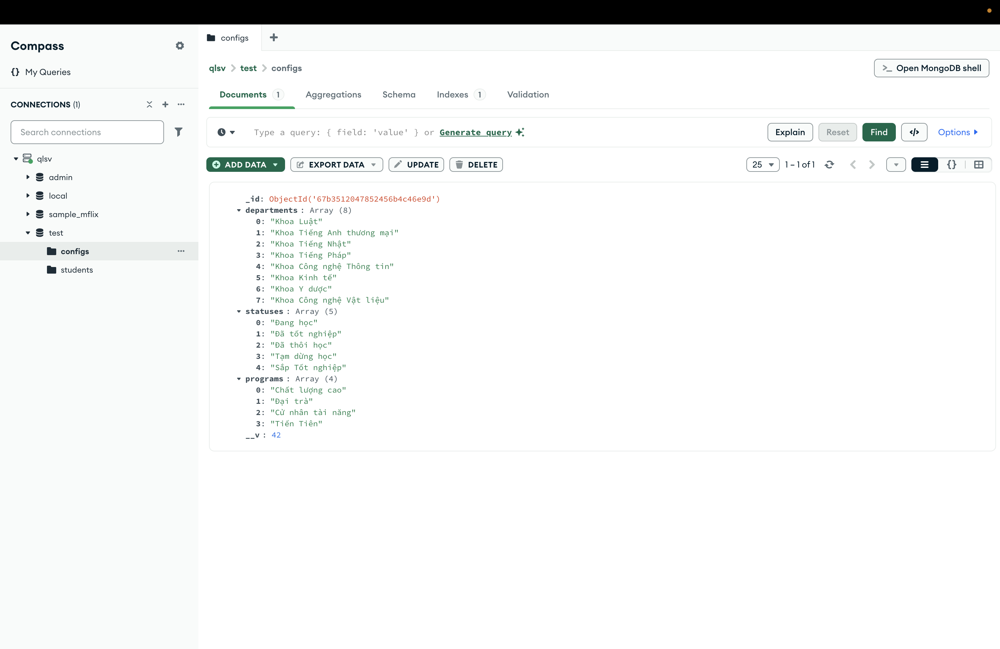
  
- **Thông tin sinh viên**:
  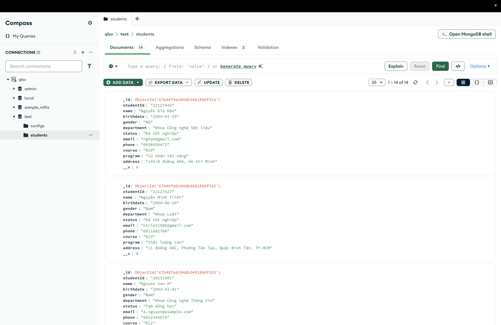

#### **2. Quản lý khoa**
- **Thêm khoa**:
  
  
- **Sửa khoa**:
  
  
- **Xóa khoa**:
  

#### **3. Quản lý chương trình học**
- **Thêm chương trình**:
  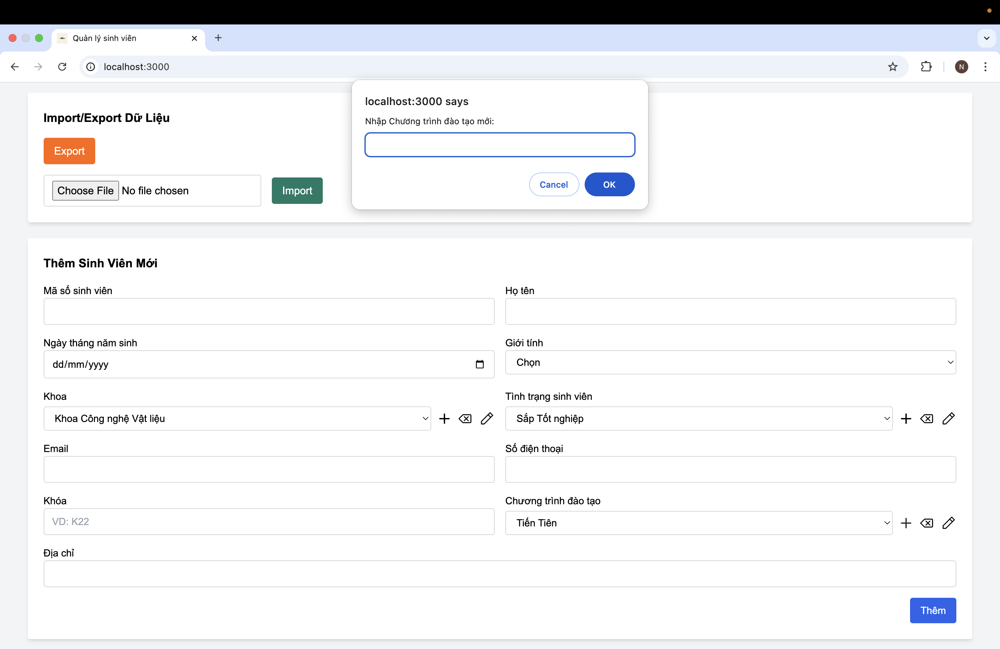

- **Sửa chương trình**:
  

- **Xoá chương trình**
  

#### **4. Quản lý trạng thái sinh viên**
- **Thêm trạng thái sinh viên**:
  

- **Sửa trạng thái sinh viên**:
  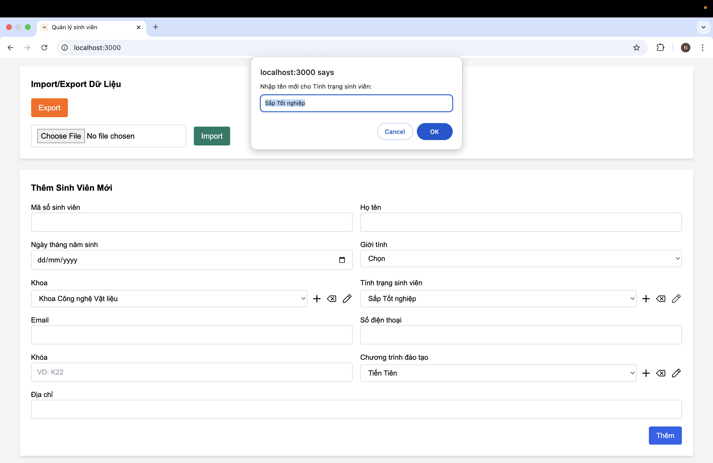

- **Xoá trạng thái sinh viên**:
  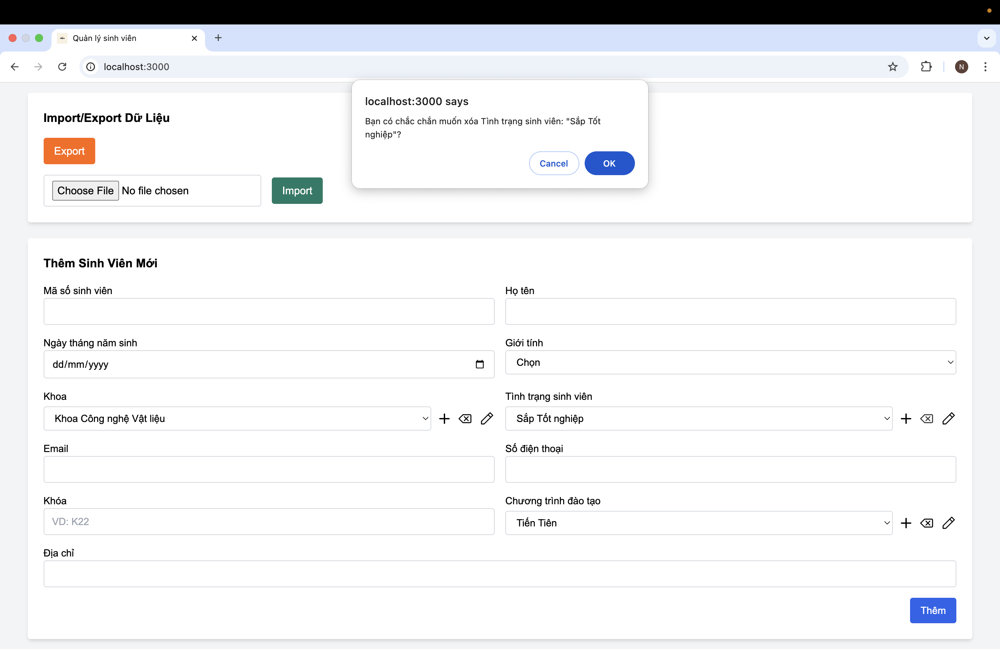

#### **5. Xuất/Nhập dữ liệu**
- **Giao diện xuất/nhập**:
  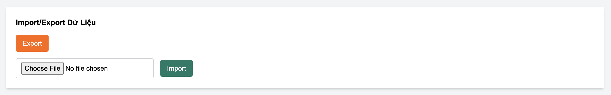

- **Chọn file nhập**:
  
  
- **Xuất dữ liệu**:
  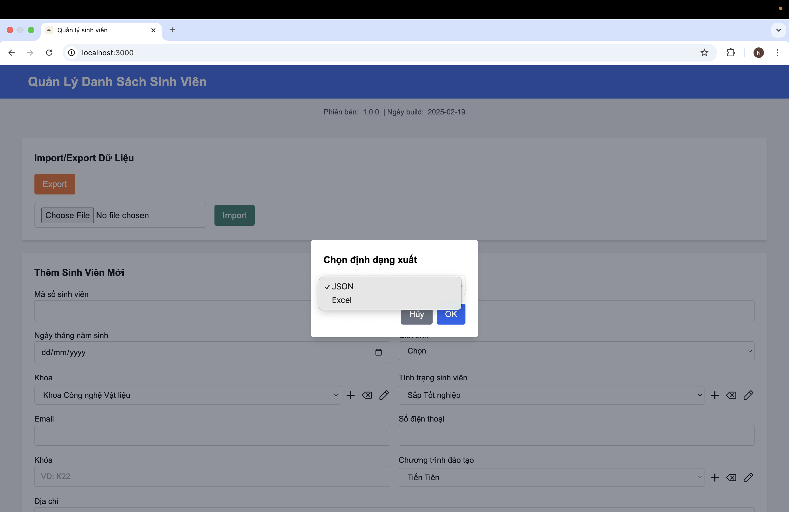
  
- **Kiểm tra file xuất**:
  

- **Import dữ liệu**:
  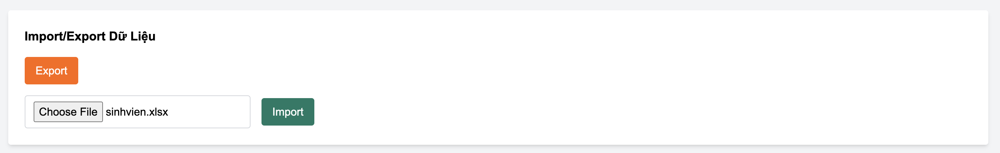

#### **6. Cơ chế ghi log**
- **Ghi log dưới dạng JSON**:
  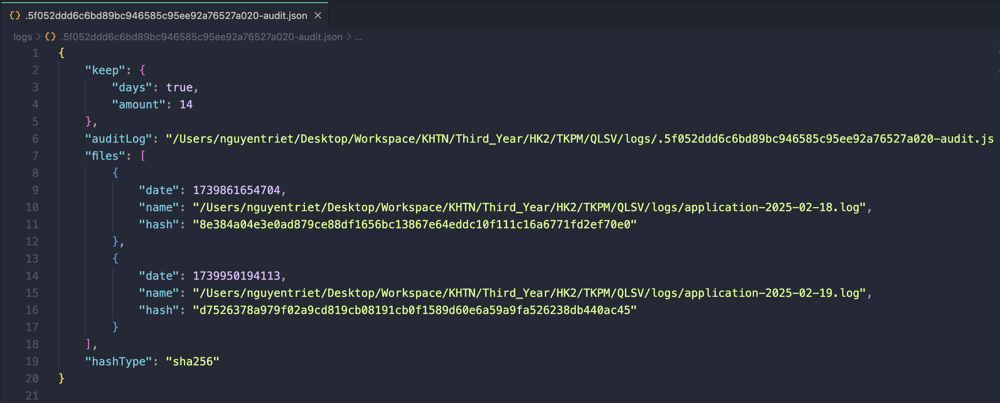
  
- **Kiểm tra lỗi**:
  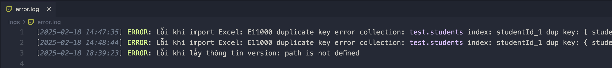

- **Thư mục log**:
  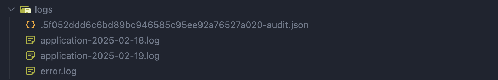

- **Log ngày 1**:
  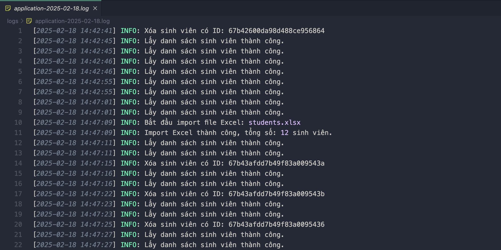

- **Log ngày 2**:
  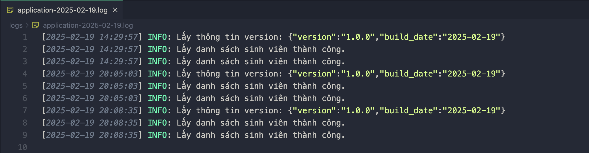

#### **7. Tìm kiếm nâng cao**
- **Tìm kiếm theo phòng ban**:
  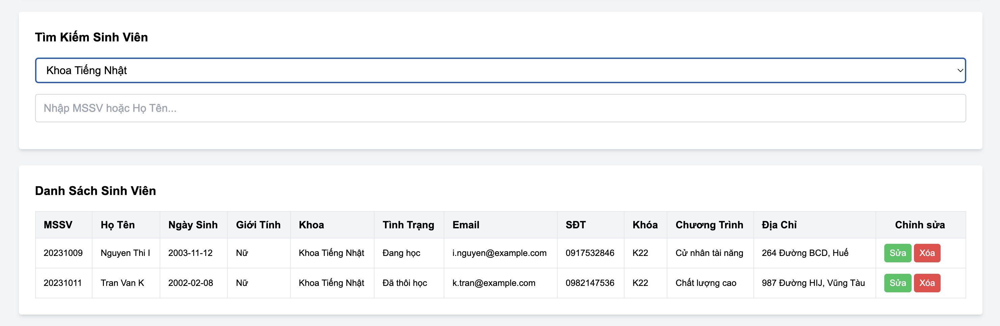

- **Tìm kiếm theo phòng ban và tên**:
  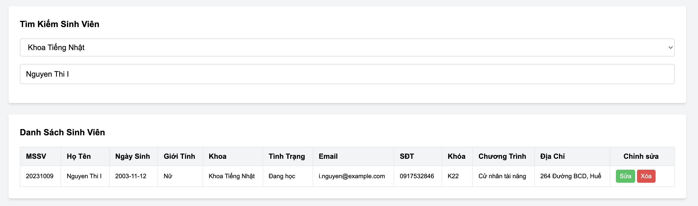

#### **8. Đồng bộ dữ liệu**
- **Đồng bộ Khoa**:
  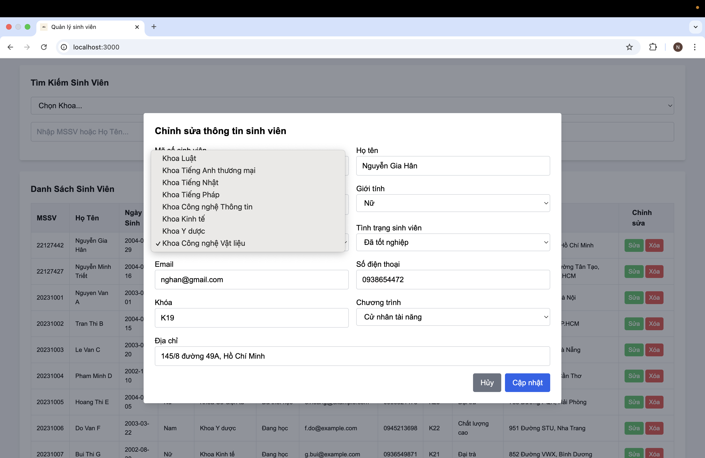

- **Đồng bộ Chương trình**:
  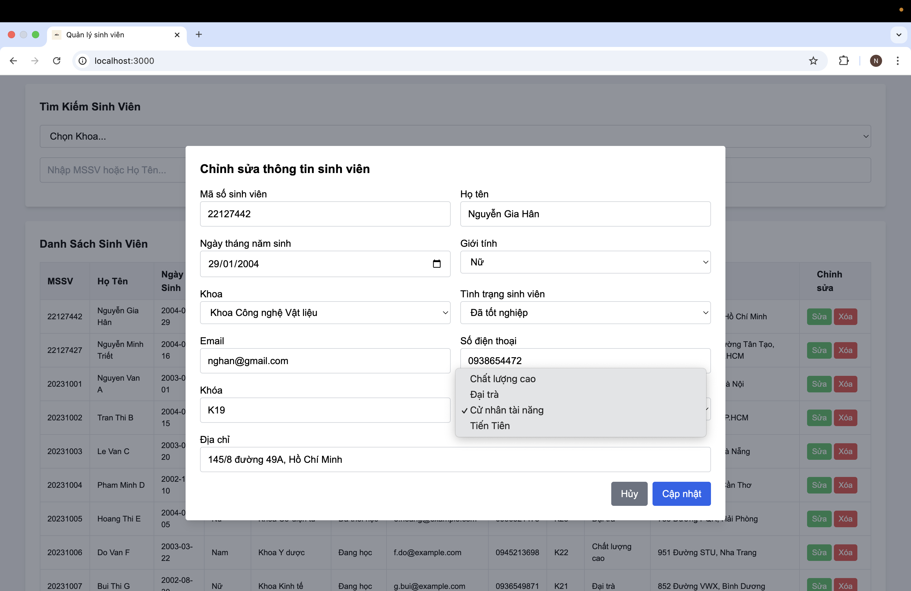

- **Đồng bộ Tình trạng sinh viên**:
  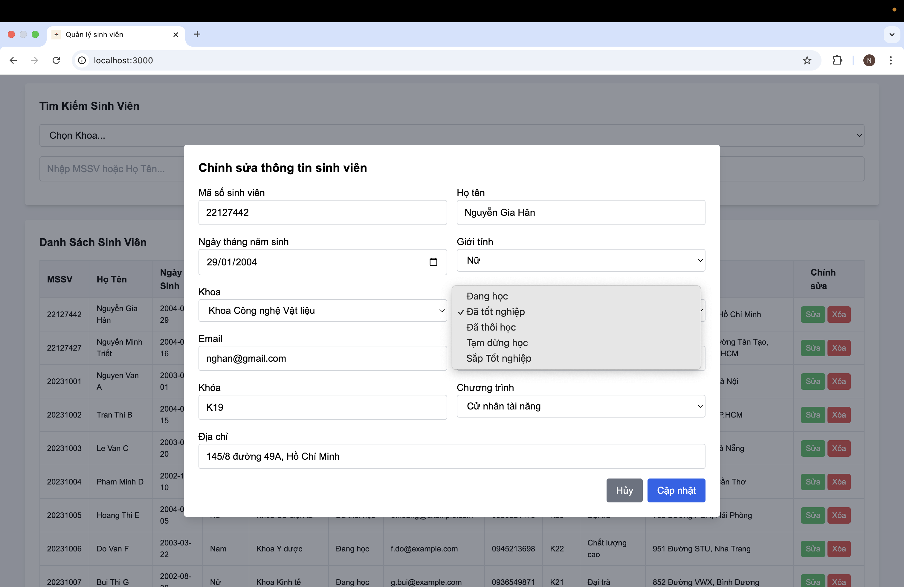

#### **9. Xây dựng thông tin phiên bản**
- **Giao diện phiên bản và ngày build**:
  

- **Phiên bản và ngày build trong log**:
  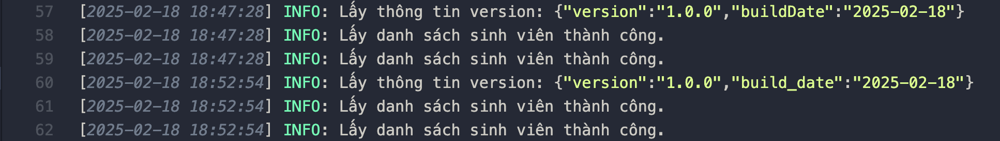

- **Phiên bản và ngày build trong Package.json**:
  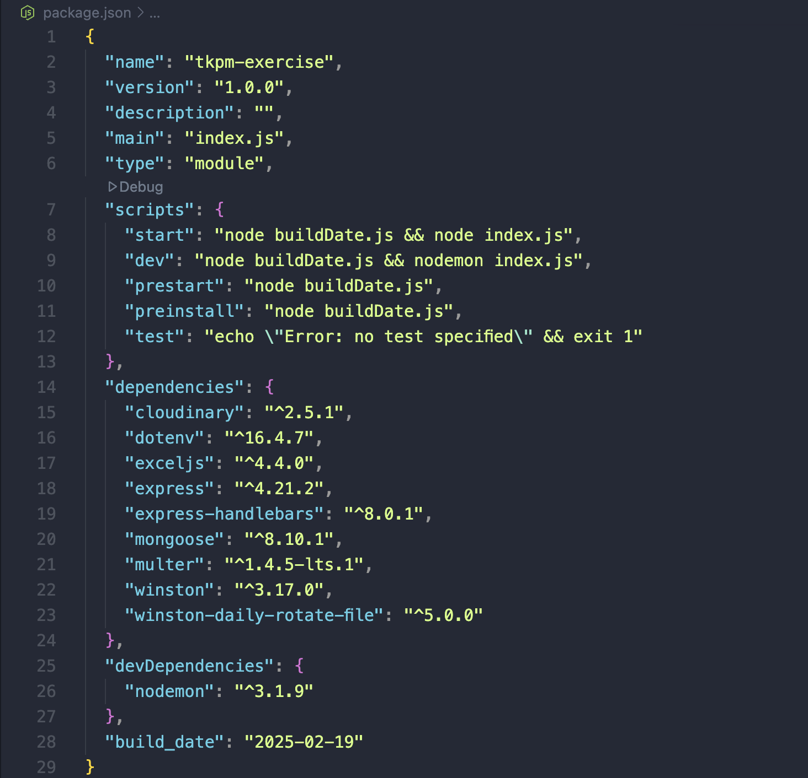

---

## 3. Hướng dẫn cài đặt và chạy chương trình trên máy

### 3.1. Cấu trúc mã nguồn

```
TKPM-EXERCISE/
│── controllers/             # Chứa các controller xử lý logic
│   ├── studentController.js # Controller quản lý sinh viên
│── database/                # Cấu hình và truy vấn cơ sở dữ liệu
│   ├── db.js                # Kết nối cơ sở dữ liệu
│── logs/                    # Lưu trữ file log hệ thống
│   ├── <mã-hash>-audit.json # File log kiểm tra hệ thống
│   ├── application-2025-02-18.log  # Log ứng dụng ngày 18/02/2025
│   ├── application-2025-02-19.log  # Log ứng dụng ngày 19/02/2025
│   ├── error.log            # File ghi log lỗi
│── models/                  # Định nghĩa mô hình dữ liệu
│   ├── Config.js            # Cấu hình hệ thống
│   ├── Student.js           # Mô hình dữ liệu sinh viên
│── node_modules/            # Thư viện phụ thuộc của dự án
│── public/                  # Tài nguyên tĩnh như CSS, hình ảnh
│   ├── css/                 # Chứa file CSS
│   ├── images/              # Chứa hình ảnh giao diện
│── routes/                  # Chứa các route định tuyến
│   ├── studentRoutes.js     # Route xử lý yêu cầu liên quan đến sinh viên
│── screenshots/             # Ảnh chụp màn hình minh họa tính năng
│   ├── version1.0/          # Ảnh chụp phiên bản 1.0
│   ├── version2.0/          # Ảnh chụp phiên bản 2.0
│── uploads/                 # Thư mục tải lên (nếu có)
│── utils/                   # Chứa các tiện ích hỗ trợ
│   ├── logger.js            # Xử lý ghi log
│── views/                   # Giao diện người dùng
│   ├── ex1.hbs              # Template giao diện bài tập
│   ├── layout.hbs           # Template bố cục chung
│── buildDate.js             # Quản lý thông tin phiên bản
│── index.js                 # File chính khởi chạy server
│── package-lock.json        # File lock version dependencies
│── package.json             # Danh sách dependencies
│── README.md                # Hướng dẫn sử dụng
```

### 3.2. Cài đặt và chạy ứng dụng

#### Bước 1: Cài đặt Node.js
Ứng dụng yêu cầu **Node.js** và **npm**. Nếu chưa có, hãy tải và cài đặt từ:
- [Node.js Download](https://nodejs.org/)

#### Bước 2: Clone repository
Mở terminal/cmd và chạy lệnh sau để tải mã nguồn:
```sh
git clone https://github.com/Alrmendo/TKPM-Exercise.git
cd TKPM-EXERCISE
```

#### Bước 3: Cài đặt dependencies
Chạy lệnh:
```sh
npm install
```

#### Bước 4: Chạy server
Chạy lệnh:
```sh
node index.js
```
Hoặc nếu dùng `nodemon` (cần cài trước bằng `npm install -g nodemon`):
```sh
nodemon index.js
```

#### Bước 5: Truy cập web
Sau khi server chạy thành công, mở trình duyệt và truy cập:
```
http://localhost:3000
```
---

## 4. Chạy từ file ZIP

#### Bước 1: Giải nén file ZIP
- Tải file `22127427.zip` và giải nén.
- Mở terminal/cmd và di chuyển vào thư mục web:
```sh
cd 22127427
```

#### Bước 2: Cài đặt Node.js
Ứng dụng yêu cầu **Node.js** và **npm**. Nếu chưa có, hãy tải và cài đặt từ:
- [Node.js Download](https://nodejs.org/)

#### Bước 3: Cài đặt dependencies
Chạy lệnh:
```sh
npm install
```

#### Bước 4: Chạy server
```sh
node index.js
```
Hoặc nếu dùng `nodemon` (cần cài trước bằng `npm install -g nodemon`):
```sh
nodemon index.js
```

#### Bước 5: Truy cập web
Sau khi server chạy thành công, mở trình duyệt và truy cập:
```
http://localhost:3000
```
