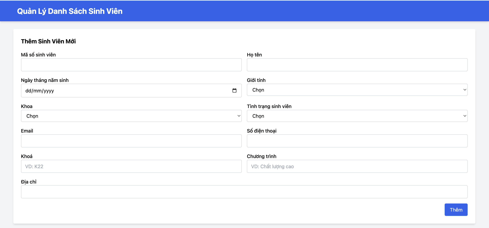
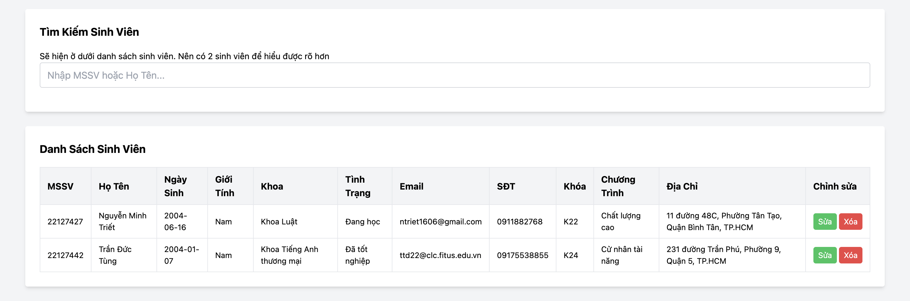
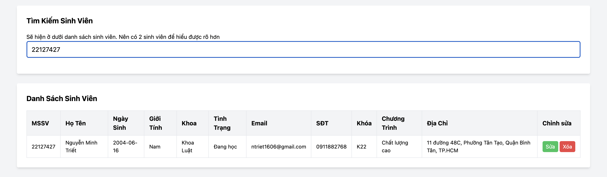
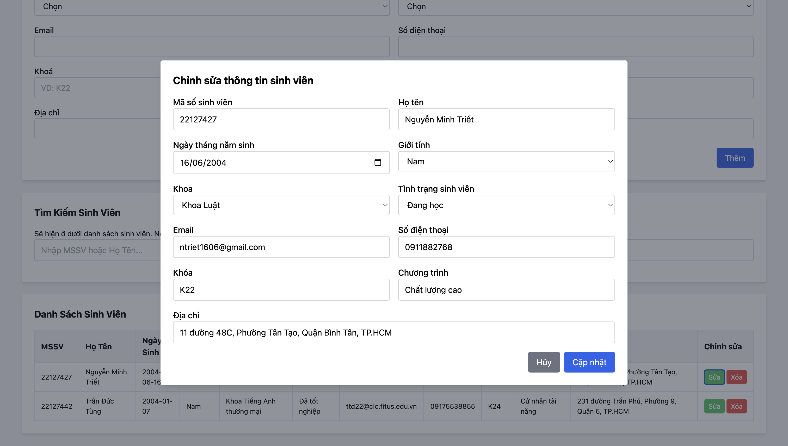
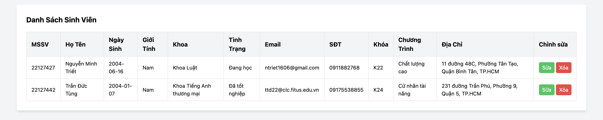
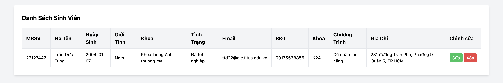
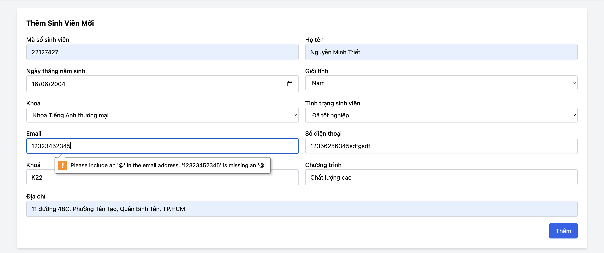
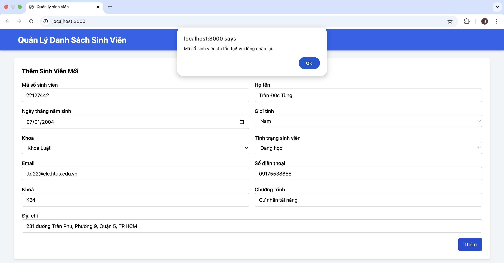
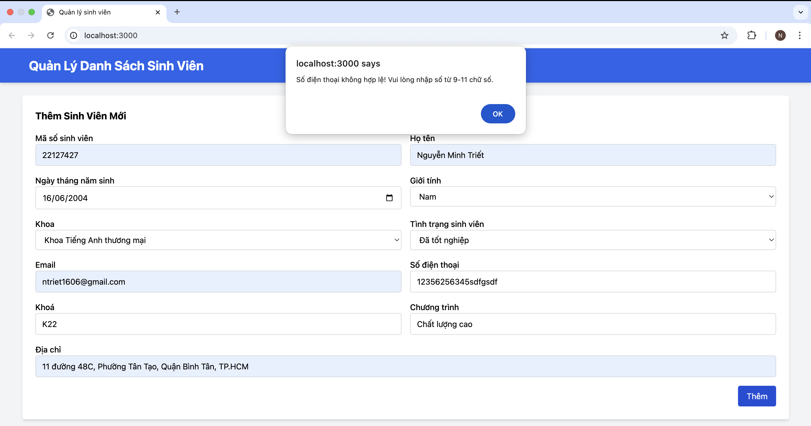

# TKPM-EXERCISE

## Mục lục
1. [Ảnh demo website quản lý sinh viên](#1-ảnh-demo-website-quản-lý-sinh-viên)
2. [Hướng dẫn cài đặt và chạy chương trình trên máy](#2-hướng-dẫn-cài-đặt-và-chạy-chương-trình-trên-máy)
   - [Cấu trúc mã nguồn](#21-cấu-trúc-mã-nguồn)
   - [Cài đặt và chạy ứng dụng](#22-cài-đặt-và-chạy-ứng-dụng)
     - [Bước 1: Cài đặt Node.js](#bước-1-cài-đặt-nodejs)
     - [Bước 2: Clone repository](#bước-2-clone-repository)
     - [Bước 3: Cài đặt dependencies](#bước-3-cài-đặt-dependencies)
     - [Bước 4: Chạy server](#bước-4-chạy-server)
     - [Bước 5: Truy cập web](#bước-5-truy-cập-web)
3. [Chạy từ file ZIP](#3-chạy-từ-file-zip)
   - [Bước 1: Giải nén file ZIP](#bước-1-giải-nén-file-zip)
   - [Bước 2: Cài đặt dependencies](#bước-2-cài-đặt-dependencies)
   - [Bước 3: Chạy server](#bước-3-chạy-server)
   - [Bước 4: Truy cập web](#bước-4-truy-cập-web)

---

## 1. Ảnh demo website quản lý sinh viên
Dưới đây là một số ảnh chụp màn hình của website:

### Thêm sinh viên mới:


### Danh sách sinh viên:


### Tìm kiếm sinh viên:


### Chỉnh sửa thông tin sinh viên:


### Xóa sinh viên (trước khi xóa):


### Xóa sinh viên (sau khi xóa):


### Kiểm tra validation email:


### Kiểm tra validation MSSV:


### Kiểm tra validation số điện thoại:


---

## 2. Hướng dẫn cài đặt và chạy chương trình trên máy

### 2.1. Cấu trúc mã nguồn

```
TKPM-EXERCISE/
│── controllers/            # Chứa các controller xử lý logic
│   ├── studentController.js # Controller mẫu
│── public/                 # Chứa các tài nguyên tĩnh (CSS, hình ảnh, JS...)
│   ├── css/
│   │   ├── app.css         # File CSS chính
│   ├── images/
│   │   ├── logo.png       # Logo trang web
│── routes/                 # Chứa các route định tuyến
│── views/                  # Chứa giao diện sử dụng Handlebars
│   ├── ex1.hbs
│   ├── layout.hbs
│── index.js                # File chính khởi chạy server
│── package.json            # Danh sách dependencies
│── package-lock.json       # File lock version dependencies
│── README.md               # Hướng dẫn sử dụng
```

### 2.2. Cài đặt và chạy ứng dụng

#### Bước 1: Cài đặt Node.js
Ứng dụng yêu cầu **Node.js** và **npm**. Nếu chưa có, hãy tải và cài đặt từ:
- [Node.js Download](https://nodejs.org/)

#### Bước 2: Clone repository
Mở terminal/cmd và chạy lệnh sau để tải mã nguồn:
```sh
git clone https://github.com/Alrmendo/TKPM-Exercise.git
cd TKPM-EXERCISE
```

#### Bước 3: Cài đặt dependencies
Chạy lệnh:
```sh
npm install
```

#### Bước 4: Chạy server
Chạy lệnh:
```sh
node index.js
```
Hoặc nếu dùng `nodemon` (cần cài trước bằng `npm install -g nodemon`):
```sh
nodemon index.js
```

#### Bước 5: Truy cập web
Sau khi server chạy thành công, mở trình duyệt và truy cập:
```
http://localhost:3000
```
---

## 3. Chạy từ file ZIP

#### Bước 1: Giải nén file ZIP
- Tải file `22127427.zip` và giải nén.
- Mở terminal/cmd và di chuyển vào thư mục web:
```sh
cd 22127427
```

#### Bước 2: Cài đặt dependencies
Chạy lệnh:
```sh
npm install
```

#### Bước 3: Chạy server
```sh
node index.js
```
Hoặc:
```sh
nodemon index.js
```

#### Bước 4: Truy cập web
Mở trình duyệt và truy cập:
```
http://localhost:3000
```

