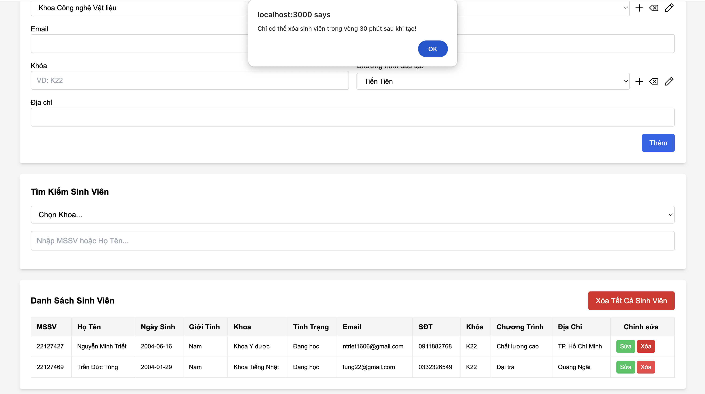
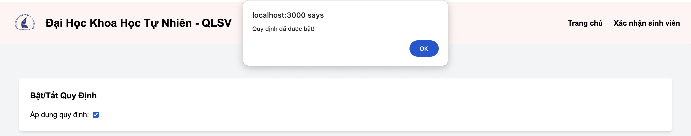
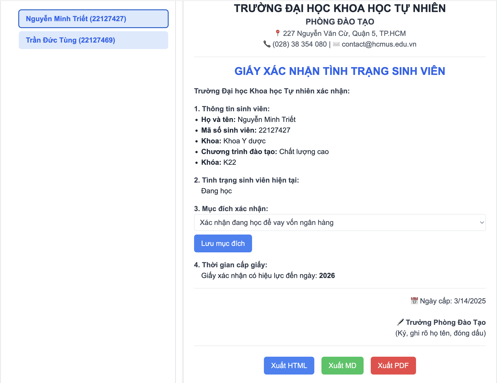

# TKPM-EXERCISE

# NOTE:
- Tính năng **"Tình trạng sinh viên chỉ có thể thay đổi theo một số quy tắc"** vẫn còn lỗi nhỏ, mặc dù đã có thể configurable nhưng việc update trong edit model vẫn còn một vài bug.
- Mặc dù code vẫn chạy bình thường nhưng source code còn khó đọc, chưa xác định hay sửa những chổ vi phạm SRP và DRY principle.

# Mục lục

1. [Chạy bằng link web](#1-chạy-bằng-link-web)  
2. [Cập nhật trong Version 4.0](#2-cập-nhật-trong-version-40)  
   - [2.1. Chỉ được phép xóa sinh viên có creation date hoặc time trong khoảng thời gian nhất định](#21-chỉ-được-phép-xóa-sinh-viên-có-creation-date-hoặc-time-trong-khoảng-thời-gian-nhất-định)  
   - [2.2. Cho phép bật tắt việc áp dụng các quy định](#22-cho-phép-bật-tắt-việc-áp-dụng-các-quy-định)  
   - [2.3. Các màn hình cần hiện logo hoặc tên Trường](#23-các-màn-hình-cần-hiện-logo-hoặc-tên-trường)  
   - [2.4. Cho phép xóa khoa, xóa tình trạng sinh viên, xóa chương trình đào tạo nếu không có ràng buộc về dữ liệu](#24-cho-phép-xóa-khoa-xóa-tình-trạng-sinh-viên-xóa-chương-trình-đào-tạo-nếu-không-có-ràng-buộc-về-dữ-liệu)  
   - [2.5. Xuất giấy xác nhận tình trạng sinh viên ra các dạng khác nhau](#25-xuất-giấy-xác-nhận-tình-trạng-sinh-viên-ra-các-dạng-khác-nhau)  
3. [Hướng dẫn cài đặt và chạy chương trình trên máy](#3-hướng-dẫn-cài-đặt-và-chạy-chương-trình-trên-máy)  
   - [3.1. Cấu trúc mã nguồn](#31-cấu-trúc-mã-nguồn)  
   - [3.2. Cài đặt và chạy ứng dụng](#32-cài-đặt-và-chạy-ứng-dụng)  
     - [3.2.1. Cài đặt Node.js](#321-cài-đặt-nodejs)  
     - [3.2.2. Clone repository](#322-clone-repository)  
     - [3.2.3. Cài đặt dependencies](#323-cài-đặt-dependencies)  
     - [3.2.4. Chạy server](#324-chạy-server)  
     - [3.2.5. Truy cập web](#325-truy-cập-web)  
4. [Chạy từ file ZIP](#4-chạy-từ-file-zip)  
   - [4.1. Giải nén file ZIP](#41-giải-nén-file-zip)  
   - [4.2. Cài đặt Node.js](#42-cài-đặt-nodejs)  
   - [4.3. Cài đặt dependencies](#43-cài-đặt-dependencies)  
   - [4.4. Chạy server](#44-chạy-server)  
   - [4.5. Truy cập web](#45-truy-cập-web)  
5. [Hướng dẫn chạy Unit Test](#5-hướng-dẫn-chạy-unit-test)  
   - [5.1. Cài đặt dependencies](#51-cài-đặt-dependencies)  
   - [5.2. Chạy Unit Test](#52-chạy-unit-test)  
   - [5.3. Kiểm tra kết quả](#53-kiểm-tra-kết-quả) 

---

## 1. Chạy bằng link web
Dạ do web em deploy bằng một nền tảng miễn phí (Render). Do đó, tốc độ tải có thể hơi chậm. Trong trường hợp trang load lâu quá, thầy có thể thử:
- Thầy ráng đợi một lúc để trang web hiển thị.
- Nếu vẫn chưa load xong, thầy hãy đóng tab đó và truy cập lại link ạ.

🔗 **Link chạy web:** https://tkpm-ex1.onrender.com/

---

## 2. Cập nhật trong Version 4.0

#### 2.1. Chỉ được phép xóa sinh viên có creation date hoặc time trong khoảng thời gian nhất định.    
- Nếu xoá sinh viên có thời gian tạo lớn hơn 30p, hệ thống sẽ hiển thị cảnh báo.  

📌 **Minh chứng:**  
  

---

#### 2.2. Cho phép bật tắt việc áp dụng các quy định  
- Nếu tắt kích hoạt các quy định thì khi nhập sai quy định, hệ thống vẫn sẽ không báo lỗi. 
- Còn khi bật kích hoạt các quy định, nếu nhập sai hệ thống sẽ hiển thị cảnh báo.  

📌 **Minh chứng:**  



---

#### 2.3. Các màn hình cần hiện logo hoặc tên Trường  
- Hiển thị logo cũng như tên trường trên header - navbar.  

📌 **Minh chứng:**  
  

---

#### 2.4. Cho phép xóa khoa, xóa tình trạng sinh viên, xóa chương trình đào tạo nếu không có ràng buộc về dữ liệu  
- Chọn khoa, tình trạng hoặc chương trình đạo tạo muốn xoá.
- Nhấp vào biểu tượng xoá, hệ thống sẽ thông báo đã xoá thành công trường tương ứng.

📌 **Minh chứng:**  
  


---

#### 2.5. Xuất giấy xác nhận tình trạng sinh viên ra **Các dạng khác nhau**
- Chọn sinh viên muốn xuất "giấy xác nhận tình trạng sinh viên"
- Sau đó chọn trong các options xuất như: HTML/MD/PDF

📌 **Minh chứng:**  
  

---

## 3. Hướng dẫn cài đặt và chạy chương trình trên máy

### 3.1. Cấu trúc mã nguồn

```
TKPM-EXERCISE/
│── controllers/             # Chứa các controller xử lý logic
│   ├── studentController.js # Controller quản lý sinh viên
│── database/                # Cấu hình và truy vấn cơ sở dữ liệu
│   ├── db.js                # Kết nối cơ sở dữ liệu
│── logs/                    # Lưu trữ file log hệ thống
│   ├── <mã-hash>-audit.json # File log kiểm tra hệ thống
│   ├── application-2025-02-18.log  # Log ứng dụng ngày 18/02/2025
│   ├── application-2025-02-19.log  # Log ứng dụng ngày 19/02/2025
│   ├── error.log            # File ghi log lỗi
│── models/                  # Định nghĩa mô hình dữ liệu
│   ├── Config.js            # Cấu hình hệ thống
│   ├── Student.js           # Mô hình dữ liệu sinh viên
│── node_modules/            # Thư viện phụ thuộc của dự án
│── public/                  # Tài nguyên tĩnh như CSS, hình ảnh
│   ├── css/                 # Chứa file CSS
│   ├── images/              # Chứa hình ảnh giao diện
│── routes/                  # Chứa các route định tuyến
│   ├── studentRoutes.js     # Route xử lý yêu cầu liên quan đến sinh viên
│── screenshots/             # Ảnh chụp màn hình minh họa tính năng
│   ├── version1.0/          # Ảnh chụp phiên bản 1.0
│   ├── version2.0/          # Ảnh chụp phiên bản 2.0
│── uploads/                 # Thư mục tải lên (nếu có)
│── utils/                   # Chứa các tiện ích hỗ trợ
│   ├── logger.js            # Xử lý ghi log
│── views/                   # Giao diện người dùng
│   ├── ex1.hbs              # Template giao diện bài tập
│   ├── layout.hbs           # Template bố cục chung
│── buildDate.js             # Quản lý thông tin phiên bản
│── index.js                 # File chính khởi chạy server
│── package-lock.json        # File lock version dependencies
│── package.json             # Danh sách dependencies
│── README.md                # Hướng dẫn sử dụng
```

### 3.2. Cài đặt và chạy ứng dụng

#### Bước 1: Cài đặt Node.js
Ứng dụng yêu cầu **Node.js** và **npm**. Nếu chưa có, hãy tải và cài đặt từ:
- [Node.js Download](https://nodejs.org/)

#### Bước 2: Clone repository
Mở terminal/cmd và chạy lệnh sau để tải mã nguồn:
```sh
git clone https://github.com/Alrmendo/TKPM-Exercise.git
cd TKPM-EXERCISE
```

#### Bước 3: Cài đặt dependencies
Chạy lệnh:
```sh
npm install
```

#### Bước 4: Chạy server
Chạy lệnh:
```sh
node index.js
```
Hoặc nếu dùng `nodemon` (cần cài trước bằng `npm install -g nodemon`):
```sh
nodemon index.js
```

#### Bước 5: Truy cập web
Sau khi server chạy thành công, mở trình duyệt và truy cập:
```
http://localhost:3000
```
---

## 4. Chạy từ file ZIP

#### Bước 1: Giải nén file ZIP
- Tải file `22127427.zip` và giải nén.
- Mở terminal/cmd và di chuyển vào thư mục web:
```sh
cd 22127427
```

#### Bước 2: Cài đặt Node.js
Ứng dụng yêu cầu **Node.js** và **npm**. Nếu chưa có, hãy tải và cài đặt từ:
- [Node.js Download](https://nodejs.org/)

#### Bước 3: Cài đặt dependencies
Chạy lệnh:
```sh
npm install
```

#### Bước 4: Chạy server
```sh
node index.js
```
Hoặc nếu dùng `nodemon` (cần cài trước bằng `npm install -g nodemon`):
```sh
nodemon index.js
```

#### Bước 5: Truy cập web
Sau khi server chạy thành công, mở trình duyệt và truy cập:
```
http://localhost:3000
```

Dưới đây là phần cập nhật cho README.md, bổ sung hướng dẫn chạy Unit Test:

---

## 5. Hướng dẫn chạy Unit Test  

Để kiểm tra các tính năng trong Version 3.0, hãy chạy Unit Test theo các bước sau:

### **Bước 1: Cài đặt dependencies (nếu chưa có)**  
Mở terminal/cmd và chạy lệnh:  
```sh
npm install
```

### **Bước 2: Chạy Unit Test**  
Sau khi cài đặt xong, chạy lệnh sau để thực hiện kiểm thử tự động:  
```sh
npm test
```

Nếu dự án sử dụng một công cụ test cụ thể như **Jest**, **Mocha**, hoặc **Chai**, bạn có thể kiểm tra trong `package.json` để biết lệnh test chính xác. Nếu dùng Jest, có thể chạy:  
```sh
npx jest
```

### **Bước 3: Kiểm tra kết quả**  
- Nếu tất cả các bài test đều thành công, bạn sẽ thấy thông báo **PASS** trên terminal.  
- Nếu có lỗi, hệ thống sẽ hiển thị chi tiết về lỗi cần khắc phục.  

📌 **Minh chứng:**  
  